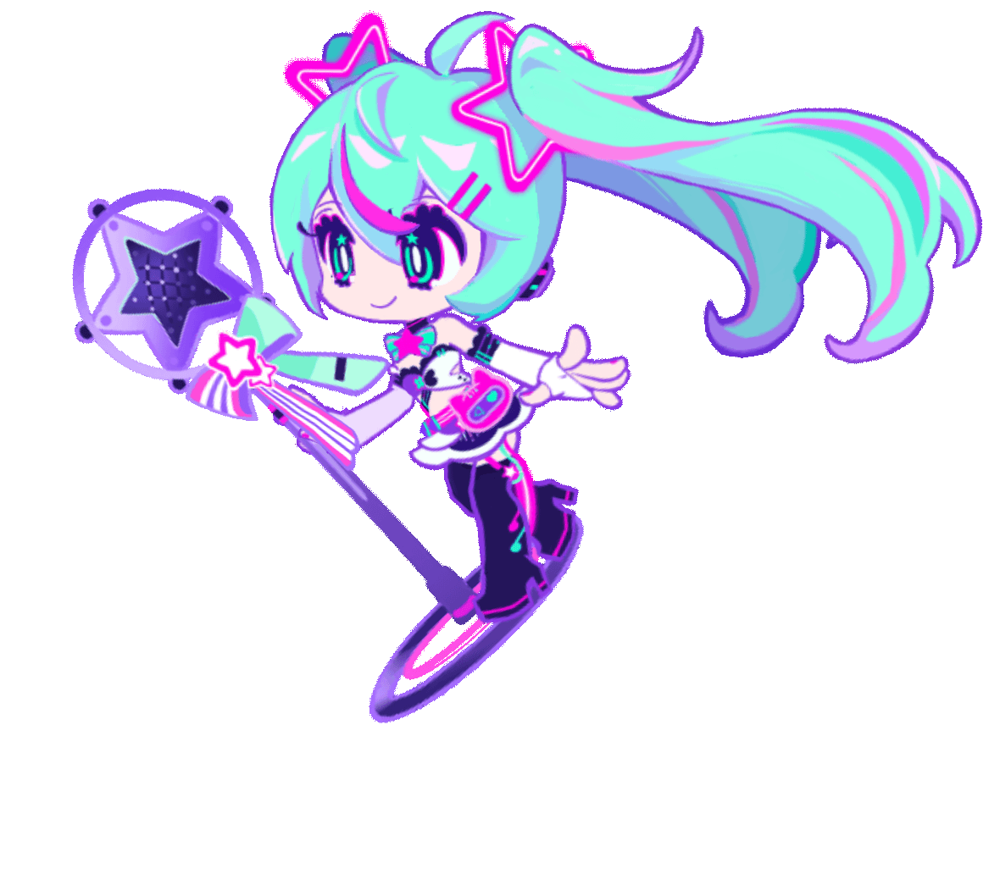
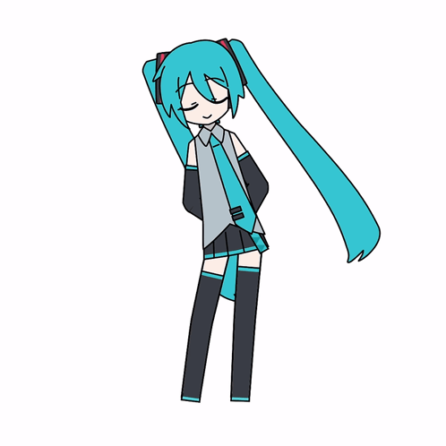

  

  
  
  
  

#

Estudante universitária de Análise e Desenvolvimento de Sistemas no IFBA e Técnica em Desenvolvimento de Sistemas pelo SENAI. Estudo nas horas vagas e me aventuro a criar projetos!
Estou constantemente atualizando meus conhecimentos e buscando novos desafios na área de tecnologia. Tenho paixão por aprender e aplicar esses conhecimentos para criar soluções inovadoras.
  
#

<h3 align="left">Connect with me!</h3>

  

<h3 align="left">My Stack ~</h3>

  
  
  
  
  
  
  
  
  
  
  
  
  
  
  
  
  
  
  
  
  
    
  

 

#

    

#

  <h3>* GitHub Stats *</h3>
  
   

#

<picture align="center">
  <source media="(prefers-color-scheme: dark)" srcset="https://raw.githubusercontent.com/m47su/m47su/output/github-contribution-grid-snake-dark.svg">
  <source media="(prefers-color-scheme: light)" srcset="https://raw.githubusercontent.com/m47su/m47su/output/github-contribution-grid-snake-dark.svg">
  
</picture>
